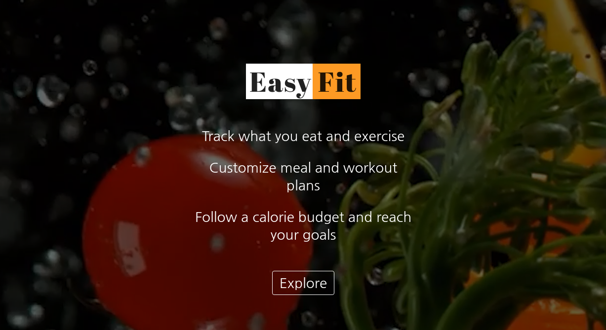

# Project Name: Easy Fit

> Track what you eat and exercise 
> Get daily meal and workout plan 
> Follow a calorie budget to reach your goal 

(1) Keep track on what you eat and exercise. It calculates how many calories you've consumed/burned from food and workout. 
(2) Customize your daily healthy meal plan (ex. classic plan, immune booster, high protein diet and simple plan) and get our recommended recipes 
(3) Customize your daily workout plan (ex. full boday workout, yoga and flexibility routine) and get our recommended videos and instructions 
(4) Get daily top articles related to health and mindfullness
(5) Reach your goal (weight loss, weight gain or wight maintenance) by following our suggested calorie budget

## Table of contents
* [General info]
* [Screenshots]

## General info

During COVID-19, physicians say they are seeing more people reporting unexpected weight gain. Stress eating, snacking out of boredom, challenges finding healthy food, and more time spent sedentary are contributing to weight management challenges. Therefore, setting up a healthy routine can be challenging. Easy-Fit helps users to shape their routines to eat better and exercise more. By simply setting a goal - such as lose 1 kg in a week - and then the program will calculate your daily calorie need. It gives you some ideas what to eat and exercise and monitor your daily food and fitness. If you follow the suggested calorie budget, you will be to reach your goal within the expected time. 

## Screenshots
 

Created By: Sawitree Kalakul
GitHub: https://github.com/webdevelopmentsk
LinkedIn: https://www.linkedin.com/in/sawitree-kalakul/

This project was bootstrapped with [Create React App](https://github.com/facebook/create-react-app).

## Available Scripts

In the project directory, you can run:

### `yarn start`

Runs the app in the development mode. 
Open [http://localhost:3000](http://localhost:3000) to view it in the browser.

The page will reload if you make edits. 
You will also see any lint errors in the console.

### `yarn test`

Launches the test runner in the interactive watch mode. 
See the section about [running tests](https://facebook.github.io/create-react-app/docs/running-tests) for more information.

### `yarn build`

Builds the app for production to the `build` folder. 
It correctly bundles React in production mode and optimizes the build for the best performance.

The build is minified and the filenames include the hashes. 
Your app is ready to be deployed!

See the section about [deployment](https://facebook.github.io/create-react-app/docs/deployment) for more information.

### `yarn eject`

**Note: this is a one-way operation. Once you `eject`, you can’t go back!**

If you aren’t satisfied with the build tool and configuration choices, you can `eject` at any time. This command will remove the single build dependency from your project.

Instead, it will copy all the configuration files and the transitive dependencies (webpack, Babel, ESLint, etc) right into your project so you have full control over them. All of the commands except `eject` will still work, but they will point to the copied scripts so you can tweak them. At this point you’re on your own.

You don’t have to ever use `eject`. The curated feature set is suitable for small and middle deployments, and you shouldn’t feel obligated to use this feature. However we understand that this tool wouldn’t be useful if you couldn’t customize it when you are ready for it.

## Learn More

You can learn more in the [Create React App documentation](https://facebook.github.io/create-react-app/docs/getting-started).

To learn React, check out the [React documentation](https://reactjs.org/).

### Code Splitting

This section has moved here: https://facebook.github.io/create-react-app/docs/code-splitting

### Analyzing the Bundle Size

This section has moved here: https://facebook.github.io/create-react-app/docs/analyzing-the-bundle-size

### Making a Progressive Web App

This section has moved here: https://facebook.github.io/create-react-app/docs/making-a-progressive-web-app

### Advanced Configuration

This section has moved here: https://facebook.github.io/create-react-app/docs/advanced-configuration

### Deployment

This section has moved here: https://facebook.github.io/create-react-app/docs/deployment

### `yarn build` fails to minify

This section has moved here: https://facebook.github.io/create-react-app/docs/troubleshooting#npm-run-build-fails-to-minify
