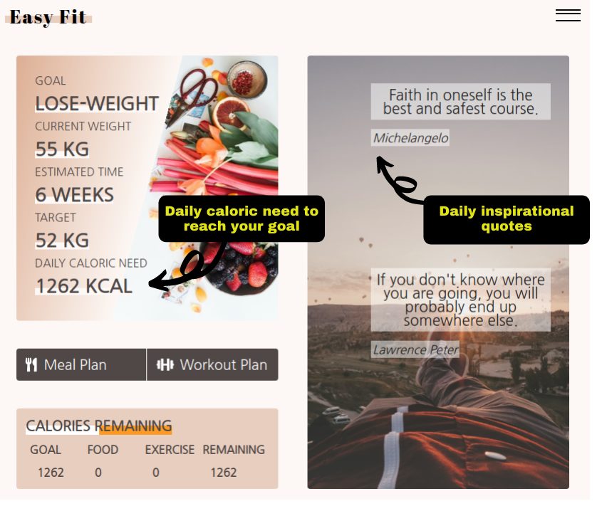
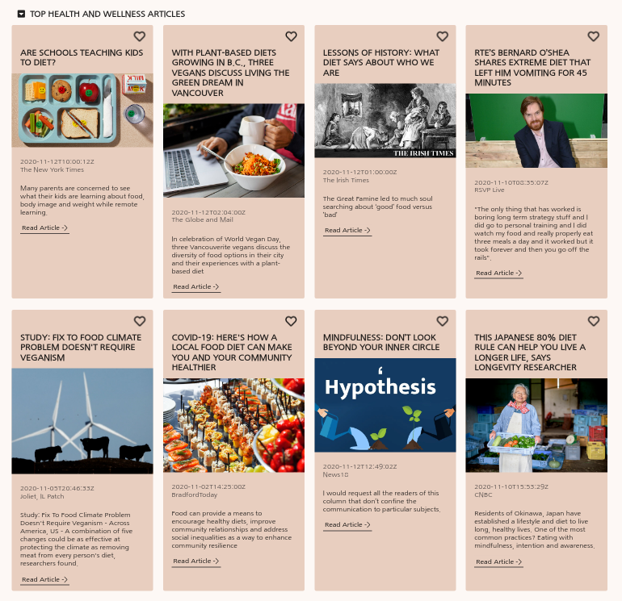
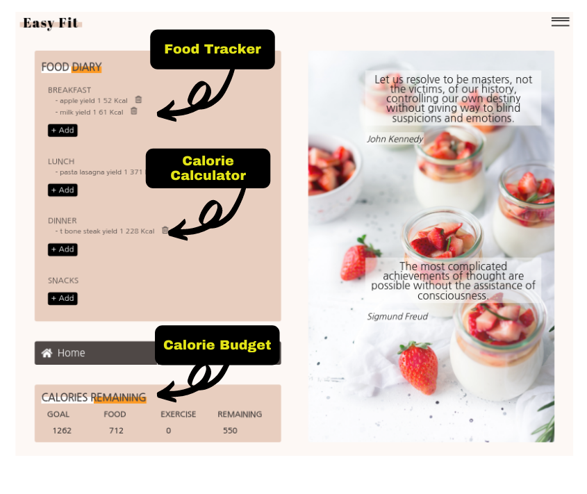
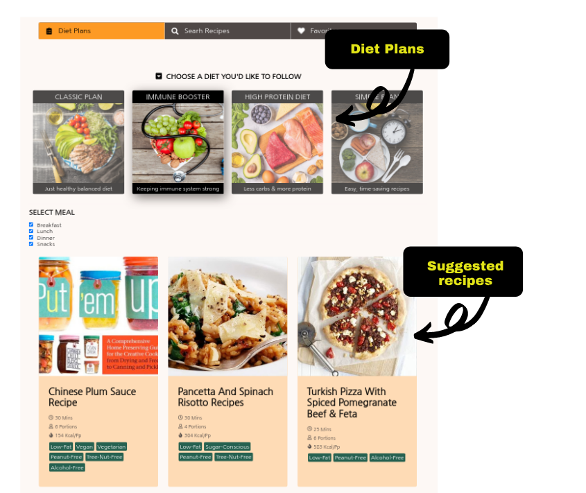
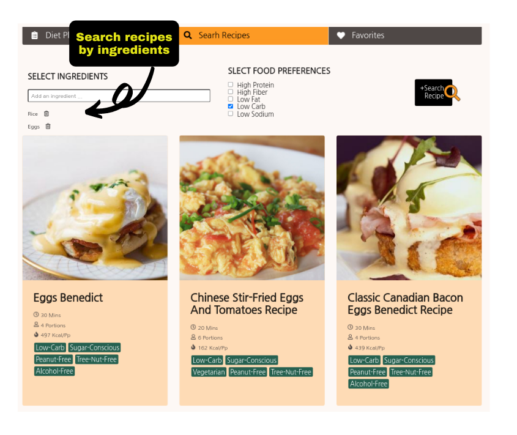
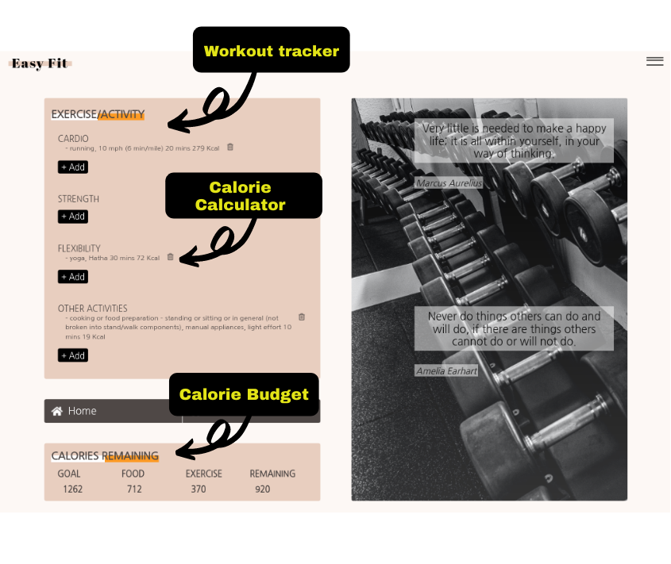

# Project Name: Easy Fit

You can visit: https://easy-fit.vercel.app
> (1) Track what you eat and exercise (2) Get daily meal and workout plan (3) Follow a calorie budget to reach your goal 

## Table of contents
* [General info](#general-info)
* [Features](#features)
* [Screenshots](#screenshots)
* [Technologies](#technologies)
* [Setup](#setup)
* [Code Examples](#code-examples)
* [Status](#status)
* [Contact](#contact)

## General info

During COVID-19, physicians say they are seeing more people reporting unexpected weight gain. Stress eating, snacking out of boredom, challenges finding healthy food, and more time spent sedentary are contributing to weight management challenges. Therefore, setting up a healthy routine can be challenging. Easy-Fit helps users to shape their routines to eat better and exercise more. By simply setting a goal - such as lose 1 kg in a week - and then the program will calculate your daily calorie need. It gives you some ideas what to eat and exercise and monitor your daily food and fitness. If you follow the suggested calorie budget, you will be to reach your goal within the expected time. 

## Features

List of Features ready:

* (1) Keep track on what you eat and exercise. It calculates how many calories you've consumed/burned from food and workout. 
* (2) Customize your daily healthy meal plan (ex. classic plan, immune booster, high protein diet and simple plan) and get  our recommended recipes 
* (3) Customize your daily workout plan (ex. full boday workout, yoga and flexibility routine) and get our recommended videos and instructions 
* (4) Get daily top articles related to health and mindfullness
* (5) Reach your goal (weight loss, weight gain or wight maintenance) by following our suggested calorie budget

TODOs:

* (1) Create a database to store user data
* (2) Implement more workout plans
* (3) Implement a tool to check grocery prices in the supermarket 

## Screenshots
 

## Technologies

* JavaScript
* HTML5
* Sass
* React
* jquery

## Setup
(1) git clone https://github.com/webdevelopmentsk/Easy-Fit-Meal-and-Workout-Plan-for-You.git
(2) yarn install
(3) yarn start

## Code Examples

    Calories Burned Formula
    Total calories burned = (Time(mins) * MET * 3.5 * Weight(kg))/200
    Refrence : Bushman B PhD. Complete Guide to Fitness and Health 2nd Edition.
    American College of Sports Medicine. Human Kinetics. 2017.
    MET = Metabolic Equivalent of Task

    const caloriesBurned = (item,state,type,quantity) => {

        let weight = convertTometric(state.userPersonalInfo.unitWeight,state.userPersonalInfo.weight);
        
        if(item.MET){
            return Math.round((item.totalTime * item.MET * 3.5 * weight)/200);
        }
        else{
            let itemIndex = -1; let MET = 0;
            activities.map((obj,index) => {
                if(obj.name === item) {itemIndex = index;} return null;
            });
            if(itemIndex > 0){MET = activities[itemIndex].MET;}
            return Math.round((quantity * MET * 3.5 * weight)/200);
        }
    };

export default caloriesBurned;
## Status
Project is in progress. The first part of the project is done. I would like to implement the database and add more features

## Contact
Create by Sawitree Kalakul (https://www.linkedin.com/in/sawitree-kalakul/) - feel free to contact me!
